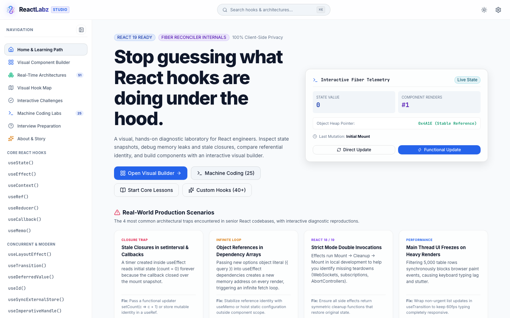
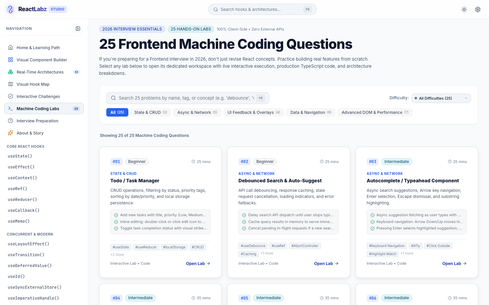
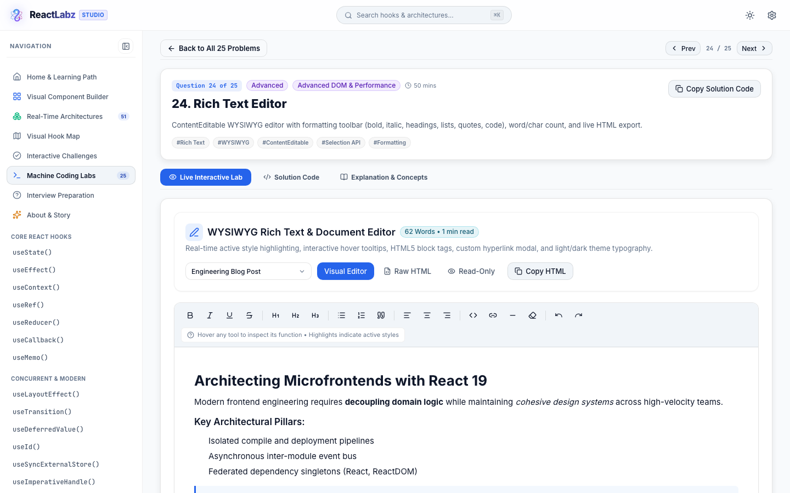
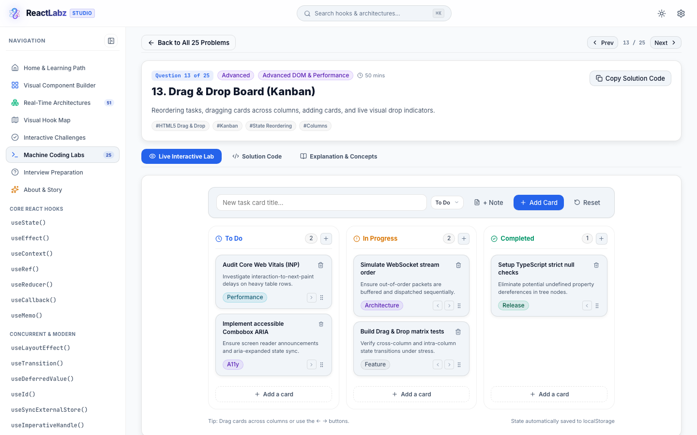
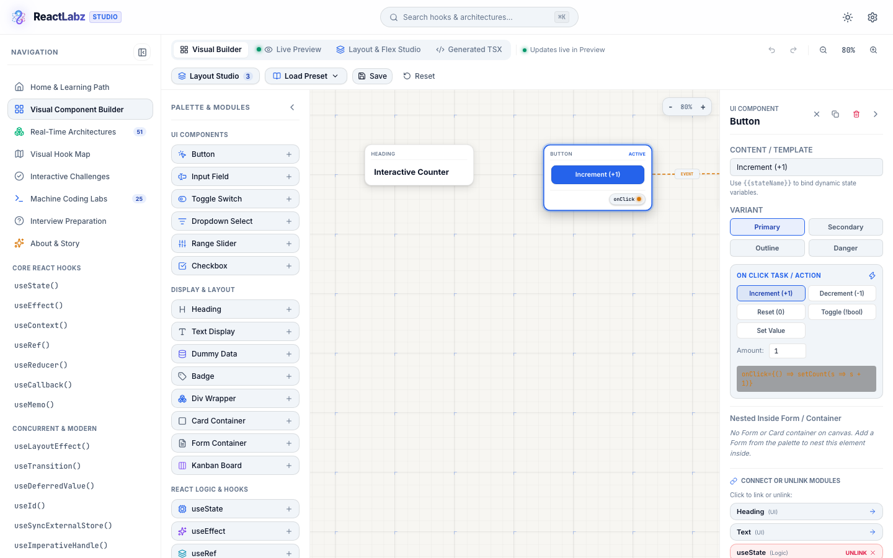
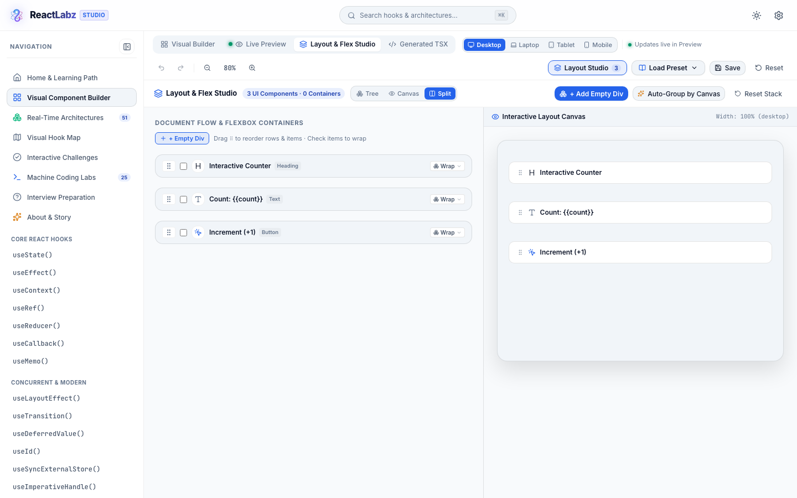
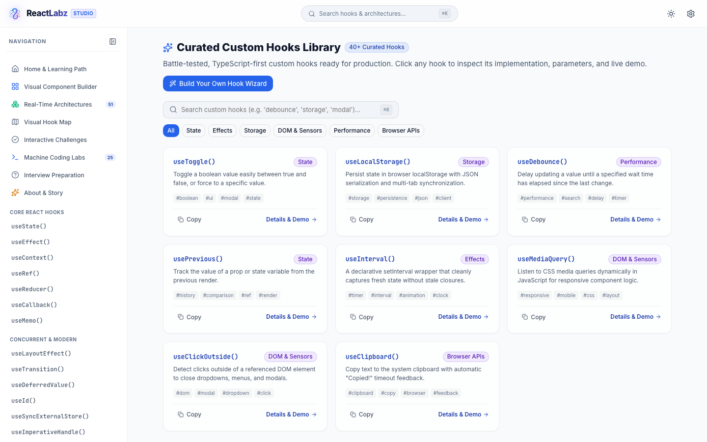
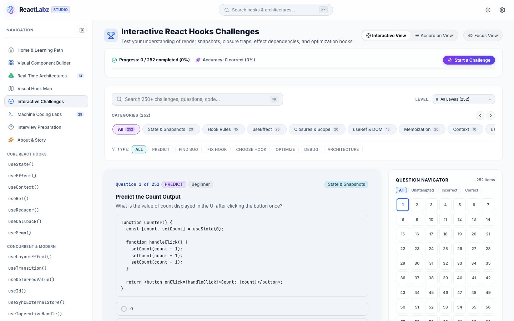

# ReactLabz - Interactive React Hooks Studio & Visual Architecture Lab

<div align="center">

[](https://react.dev)
[](https://www.typescriptlang.org/)
[](https://vitejs.dev/)
[](#3-25-frontend-machine-coding-questions--interactive-labs-machine-coding)
[](#11-local-first-privacy--zero-backend)
[](LICENSE)

**Stop guessing what React hooks are doing under the hood.**  
A visual, hands-on diagnostic laboratory and machine coding suite for React engineers. Inspect state snapshots, debug memory leaks and stale closures, compare referential identity, construct functional components on an infinite visual canvas, and master 25 real-world machine coding problems with live sandboxes.

[**Explore Live Demo**](https://reactlabz.vercel.app/) · [**Report Issue**](https://github.com/thevarunnayak/react-hooks/issues) · [**Request Feature**](https://github.com/thevarunnayak/react-hooks/issues)

</div>

---

## Visual Tour

<div align="center">

### Home & Interactive Fiber Telemetry


### Frontend Machine Coding Question Bank (25 Real-World Labs)


### Interactive Code Editor & Live Compiler Sandbox


### WYSIWYG Rich Text Editor & Live Document Studio


### HTML5 Drag-and-Drop Kanban Board


### Infinite Visual Component Builder & Canvas Playground


### Visual Layout & Flex Studio


### Curated Custom Hooks Catalog (40+ Hooks)


### Senior React Interview Simulator & Challenges Lab


</div>

---

## Highlights & Core Features

### 1. Visual Component Builder & Infinite Playground (`#playground`)
*Figma-meets-ReactFlow component construction with zero build step.*
- **Infinite Dot-Grid Canvas**: Pan, smooth zoom (0.5x to 2.0x), grid snap, mini-map, and canvas reset.
- **Rendered UI Component Nodes**: Nodes render as actual interactive UI elements rather than abstract boxes:
  - Buttons (Primary, Secondary, Outline, Danger)
  - Inputs, Headings, and dynamic Text with reactive template binding (`{{count}}`)
  - Switches, Checkboxes, Range Sliders, and Dropdowns
  - Cards, Containers, Badges, and Feedback Forms
  - **Curated Dummy Data Nodes**: 8 rich preset datasets (*Products*, *Frameworks*, *Team*, *Crypto/Stocks*, *Kanban Tasks*, *Countries*, *Articles*, *Tokens*) with 4 switchable display formats (*Cards*, *Pills*, *Grid*, *Table*).
  - **Interactive Kanban Board**: Fully draggable cards across columns with real-time status counts.
- **Logic & Hook Nodes**: Add `useState`, `useEffect`, `useRef`, `useReducer`, `useMemo`, `useCallback`, `useContext`, `useId`, `useTransition`, `useLayoutEffect`, `useDeferredValue`, `useOptimistic`, `useActionState`, `useFormStatus`, `useSyncExternalStore`, and Timers.
- **Semantic Port Wiring**:
  - `Event` (amber): Button clicks → state setter / action dispatch
  - `Data` (cyan): State values → UI text / input content
  - `Dependency` (purple): State triggers → `useEffect` / `useMemo` dependency arrays
- **Interactive Live Preview with Execution Tracing**: Interact with the rendered application; button clicks pulse the path across the canvas (`User Click → Event → State Update → Render → UI Update`).
- **UI Sequence Ordering Control**:
  - Reorder components via Up/Down/Top/Bottom controls or native **drag-and-drop handles**.
  - 1-click **"Auto-Sort by Canvas"** automatically aligns the UI layout top-to-bottom and left-to-right based on canvas coordinates.
  - Floating, draggable sequence modal window with instant position reset.
- **Dynamic Real-Time Code Generator**: Generates clean, production-ready, idiomatic TypeScript React code respecting the exact UI sequence, state variables, hooks, imports, and handlers.
- **50 Curated Real-Time Architecture Presets**: Instant loading of architectures ranging from simple Counters and Stopwatches to complex Race Condition Controllers, WebSockets, Suspense Streaming, and Performance Observatories.
- **Full Undo / Redo**: Robust command pattern history stack (`⌘Z` / `⌘ShiftZ`).

---

### 2. Visual Layout & Flex Studio (`#playground` - Layout Studio)
*Hierarchical flexbox composition, recursive container nesting, and responsive device simulation.*
- **Visual Container Composer**: Wrap arbitrary UI elements into semantic `<div>` or `<Card>` containers with instant flex direction toggling (`Row ⇄` / `Col ⇅`).
- **Custom Justify, Gap & Item Sizing Controls**:
  - **Custom Justify Dropdown**: Full flexbox alignment support (`Start`, `Center`, `End`, `Space Between`, `Space Around`, `Space Evenly`, `Stretch`) plus an inline **Custom Value** input for specialized alignment rules.
  - **Custom Gap Dropdown**: Comprehensive presets (`0px`, `4px`, `8px`, `12px`, `16px`, `20px`, `24px`, `32px`, `40px`), rapid `-2px` / `+2px` stepper buttons, and an inline **Custom Gap** field supporting arbitrary pixel or rem spacing (`14px`, `18px`, `2rem`, etc.).
  - **Custom Item Flex Sizing Dropdown**: Replaced native selects on child items with a custom sizing popover featuring presets (`flex-1`, `auto`, `100% Width`, `50% Width`, `33.3% Width`, `25% Width`), quick fixed-width chips (`120px` to `320px`), and an arbitrary custom width input (`px`, `%`, `fr`).
  - **Portal Floating Menus**: Custom menus float above the canvas layout with smooth backdrop blur and boundary collision protection, preventing clipping from container rounded borders.
- **Recursive Container Nesting & Ejection**:
  - Drag containers into other containers to create complex multi-tiered UI architectures with full drag-and-drop reordering.
  - Dedicated **Eject** control to promote nested containers back to the top-level document flow.
  - **Unwrap / Dissolve** containers cleanly back to standalone elements with one click.
- **Responsive Multi-Device Preview**:
  - Live preview simulation across **Desktop**, **Laptop**, **Tablet**, and **Mobile** viewports with realistic container wrapping and styling.
  - Switch between **Split View** (Structure Tree + Interactive Layout Canvas) and **Structure Only** focus mode.
- **Smart Auto-Grouping**: 1-click clustering that detects canvas Y-axis proximity and groups visually aligned components into flex rows automatically.
- **Code Generation Sync**: Generates clean, production-ready React JSX with inline flexbox styles and nested containers that mirror the layout hierarchy exactly.

---

### 3. 25 Frontend Machine Coding Questions & Interactive Labs (`#machine-coding`)
*Practice building real, high-frequency frontend machine coding features from scratch with 100% client-side live sandboxes.*

#### Curated Problem Catalog Across 5 Specialized Domains:
1. **Interactive Component Systems**:
   - **Tree View Explorer**: Hierarchical folder/file structure with conditional root file creation, node rename, add, delete, and light/dark theme tokens.
   - **Split Pane Resizer**: Multi-pane resizer supporting `2 Panes (Split)`, `3 Panes (Nested Right)`, `3 Panes (Columns)`, and `4 Panes (2x2 Grid)` with dynamic pane adders and mouse/touch drag listeners.
   - **Hierarchical Breadcrumb Navigator**: Interactive multi-tier hub navigation (`Cloud Console`, `E-Commerce Store`, `Developer Docs`) with cascading hover previews and segment jumping.
   - **Responsive Tabs System**: Smooth sliding active pill indicator supporting horizontal and responsive vertical stacked orientations.
   - **Nested Accordion FAQ**: CSS Grid `0fr -> 1fr` natural height transitions with WAI-ARIA compliance and single/multi expand modes.
   - **Modal Dialog with Focus Trap**: React Portal, keyboard focus trap, Esc key dismissal, and background scroll lock.
2. **Data-Intensive & High-Performance Lists**:
   - **List Virtualization**: Renders 10,000 items at 60 FPS using a fixed-height sliding window, DOM node counter, and memory telemetry.
   - **Advanced Data Table**: Multi-column sorting, global search, pagination, row multi-selection, and 1-click export to CSV / PDF.
   - **Infinite Scroll Feed**: IntersectionObserver sentinel detection, skeleton loading cards, simulated network failure & retry.
   - **Image Carousel**: Single Slide, Center-Stage Peek, and Multi-Card responsive modes with touch swipe gestures and auto-play hover pause.
3. **Interactive Tools & Real-Time Studios**:
   - **Interactive Code Editor & Live Compiler**: Multi-language execution sandbox (JavaScript, TypeScript, CSS, JSON) with intercepted console output, error reporting, and duration benchmarks.
   - **WYSIWYG Rich Text Editor**: Custom in-theme hyperlink modal dialog (no browser prompts), live hover explainer ribbon, and active style highlighting for 14 formatting modes.
   - **Drag-and-Drop Kanban Board**: HTML5 drag-and-drop tasks across columns with status counts, priority tags, and inline task creation.
   - **Product Gallery with 2.5x Zoom**: Multi-angle image switcher, interactive zoom lens panel, and elevated stacking contexts.
4. **Forms & User Input Controls**:
   - **Debounced & Throttled Search**: Rapid keyboard input simulation, sliding debounce delay slider, in-memory query caching, and AbortController request simulation.
   - **Autocomplete Combobox**: Keyboard navigation (Arrow keys / Enter / Esc), matched substring highlighting, and click-outside dismissal.
   - **Multi-Step Form Wizard**: Multi-phase stepper, field validation, animated progress bar, and final review summary.
   - **Dynamic Date Picker & Range Selector**: Single date and range selection, circular/rounded day cells, and quick preset buttons.
   - **Star Rating Component**: Fractional hover preview, keyboard accessibility, and form value submission.
   - **Drag-and-Drop File Uploader**: Multi-file dropzone, upload progress tracking, pause/resume simulation, and size validation.
5. **Async & Real-Time Applications**:
   - **Real-Time Chat with Auto-Scroll**: Intelligent scroll-to-bottom suppression when reading history, floating unread counter pill, and synthetic typing indicators.
   - **Live Poll & Voting System**: Real-time percentage bars, custom option submission, and multi-option vote tracking.
   - **Toast Notification Queue**: Multi-position stacking (`top-right`, `bottom-center`, etc.), shrinking progress countdown, and hover pause.
   - **Draggable Grid Dashboard**: Widget drag-and-drop customization with layout persistence.
   - **Interactive Todo List**: Action reducer architecture, localStorage persistence, priority tags, and inline double-click editing.

#### Every Problem Includes:
- **Interactive Live Sandbox**: Test the component in real time with interactive controls and diagnostic telemetry.
- **Production Solution Code**: Full TypeScript / React 19 source code with 1-click copy-to-clipboard.
- **Architectural Deep-Dives**: Functional & Non-Functional requirements, core concepts, and key patterns.
- **Interview Edge Cases**: Comprehensive list of candidate pitfalls and edge cases to watch out for.
- **Sequential Navigation**: Prev, Next, and All 25 Problems bottom navigation bar.
- **100% Responsive & Theme Adaptive**: Seamless experience across mobile (<640px), tablet (640px–860px), and desktop (>860px) in both Light and Dark modes.

---

### 4. Audio Interview Coach & Live Transcript Drawer
*Listen to senior engineering interview breakdowns on the go with synthesized audio lessons.*
- **Floating Audio Coach Player**: Persistent player with play/pause, seek scrub bar, speed multiplier (`0.75x` to `2.0x`), and track progress.
- **Interactive Transcript Drawer**: Synchronized line-by-line transcript highlighting with clickable timestamp jumping.
- **Customizable Voice Packs**: Switch between natural voice personalities and configure pitch and rate preferences.
- **Resume Audio Banner**: Smart persistent notification to quickly resume in-progress interview audio lessons from anywhere in the app.

---

### 5. Global Scroll-to-Top Floating Capsule (`ScrollToTopNotch`)
*Fluid, non-intrusive viewport navigation for deep technical pages.*
- **Floating Dynamic Capsule**: Centered at the top of the viewport with a live reading percentage indicator.
- **Hover Expansion**: Smoothly expands to reveal a "Back to Top" label and icon.
- **Smooth 1-Click Scroll**: Instantly returns to the top with smooth animation.

---

### 6. Deep Interactive Visualizers & Diagnostics
- **Render Visualizer**: Live render counters and causality diffs ("Why did this render?").
- **Referential Equality Visualizer**: Live comparison of memory addresses (`0xCAFE` vs new allocations), explaining why unmemoized objects break `useEffect` and `React.memo`.
- **Closure Visualizer**: Interactive async timer demonstrating stale closures in callbacks and how `useRef` or functional updates solve them.
- **Effect Lifecycle Visualizer**: Visual progression from Render → Commit → Screen Paint → Cleanup → Effect execution.
- **State Update & Batching Lab**: Side-by-side comparison of direct updates `setCount(count + 1)` vs queued functional updates `setCount(c => c + 1)`.
- **Strict Mode Lab**: Visualizing development double-invocations (`Mount → Unmount → Mount`) and cleanup idempotency.
- **Concurrent React Lab**: `useTransition` and `useDeferredValue` with CPU lag testing to demonstrate non-blocking typing.

---

### 7. Comprehensive 20-Part Hook Curriculum (18+ Hooks)
Every hook follows a standardized 20-part educational specification:
- **Core Hooks**: `useState`, `useEffect`, `useContext`, `useRef`, `useReducer`, `useCallback`, `useMemo`
- **Lifecycle & DOM**: `useLayoutEffect`, `useImperativeHandle`
- **Concurrent & Modern**: `useTransition`, `useDeferredValue`, `useId`, `useSyncExternalStore`
- **React 19 Modern Hooks**: `useActionState`, `useOptimistic`, `useFormStatus`

---

### 8. Curated Custom Hooks Catalog (40+ Hooks) & Builder (`#custom-hooks`)
- Searchable catalog across State, Effects, Storage, DOM & Sensors, Performance, and Browser APIs.
- Includes `useLocalStorage`, `useDebounce`, `useInterval`, `useClickOutside`, `useMediaQuery`, `useClipboard`, `usePrevious`, `useThrottle`, `useOnlineStatus`, `useIdleTimer`, etc.
- **"Build Your Own Hook"** wizard generating boilerplate, hints, parameters, and test structures.

---

### 9. Senior React Interview Preparation & Real-Time Challenges (`#challenges`)
- **Interactive Challenge Lab**:
  - Predict Output
  - Find the Bug
  - Fix the Hook
  - Optimize Performance
- **Senior React Interview Simulator**:
  - Multi-tier difficulty tracks: `Junior`, `Mid`, `Senior`, `Lead`, `Principal`, `Architect`.
  - Short answers, architectural deep dives, common candidate pitfalls, and interactive follow-up questions.

---

### 10. Universal Command Palette (`⌘K`) with AI Speech-to-Text
- Global modal searching across all hooks, custom hooks, machine coding labs, architecture blueprints, and interview challenges.
- Fuzzy keyword and full-content matching with highlighted text snippets.
- **Web Speech API Microphone Input**: Real-time voice search with animated listening indicator and automatic background scroll locking.
- Fast category filter pills (`All`, `Hooks`, `Custom Hooks`, `Machine Coding`, `Architectures`, `Challenges`, `Interview`).

---

### 11. Local-First Privacy & Zero Backend
- **100% Client-Side Privacy**: All notes, bookmarks, challenge submissions, machine coding state, and canvas projects persist strictly in the browser's `localStorage`.
- **Zero Cloud Dependence**: No mandatory account registration, cookies, or external databases.
- **JSON State Backup & Restore**: Export and import your entire workspace state with 1 click from the Settings drawer.
- **Theme System**: Dark, Light, and System modes with sleek glassmorphic surfaces and high-contrast typography.

---

### 12. Origin Story & Community Ideas Mailbox (`#about`)
- **The Core Problem Statement**: Why mastering React hooks is deceptively difficult when candidates only memorize surface syntax without understanding Fiber reconciliation, closures, and the reactive render pipeline.
- **Origin & Vision**: The story of turning invisible runtime mechanics into an interactive visual diagnostic laboratory.
- **Community Co-Creation**: Direct suggestion mailbox to submit custom UI ideas, tricky interview questions, and feature requests.

---

## Project Structure

```text
react-hooks/
├── public/
│   ├── og-image.svg          # 1200x630 Social card preview
│   ├── robots.txt            # Search crawler directives
│   ├── sitemap.xml           # XML sitemap for SEO
│   └── site.webmanifest      # PWA application manifest
├── docs/
│   └── screenshots/          # High-resolution application screenshots (Light Mode)
├── src/
│   ├── types/                # TypeScript models (Playground, Machine Coding, Challenges, Hooks)
│   ├── styles/               # Design tokens, variables, typography, and glassmorphic UI
│   ├── hooks/                # Core hooks (useLocalStorage, useClickOutside, useTheme, etc.)
│   ├── i18n/                 # Localization dictionaries
│   ├── data/
│   │   ├── hooks/            # 18+ Comprehensive Hook guides (20-part spec)
│   │   ├── custom-hooks/     # 40+ Curated custom hook implementations
│   │   ├── machineCoding/    # 25 Frontend Machine Coding Questions (Parts 1–5)
│   │   ├── challenges/       # Bug finding, output prediction, and optimization
│   │   └── interviews/       # Senior React interview question bank
│   ├── components/
│   │   ├── ui/               # Primitives (Button, Card, Badge, Modal, Tabs, Tooltip, ScrollToTopNotch)
│   │   ├── layout/           # AppShell, Header, Sidebar, CommandPalette, SettingsDrawer
│   │   ├── visualization/    # RenderVisualizer, ReferentialVisualizer, ClosureVisualizer
│   │   ├── labs/             # Dedicated hook deep-dive interactive labs
│   │   ├── interviewAudio/   # AudioCoachPlayer, TranscriptDrawer, AudioSettingsModal
│   │   ├── machineCoding/    # 25 Interactive Machine Coding Sandboxes
│   │   │   ├── labs/         # TreeViewLab, SplitPaneLab, CodeEditorLab, RichTextEditorLab, etc.
│   │   │   └── MachineCodingLabRunner.tsx
│   │   └── playground/       # VISUAL CANVAS & COMPONENT BUILDER
│   │       ├── canvas/       # Dot-grid viewport, SVG wires, CanvasToolbar
│   │       ├── nodes/        # UIComponentNode (real UI) & LogicHookNode
│   │       ├── panels/       # ComponentPalette, Inspector, LivePreviewPanel, UIOrderModal
│   │       ├── engine/       # Code generator, history stack, and wiring engine
│   │       └── tutorials/    # 50 curated real-time architecture blueprints
│   ├── services/             # Audio coach builder, search indexing, voice packs
│   └── pages/                # HomePage, PlaygroundPage, MachineCodingPage, ChallengesPage, etc.
└── package.json
```

---

## Getting Started Locally

### Prerequisites
- **Node.js**: `v18.0.0` or higher (tested on Node v20/v24/v25)
- **Package Manager**: `npm` (v9+) or `pnpm` / `yarn`

### Installation & Development
```bash
# 1. Clone repository
git clone https://github.com/thevarunnayak/react-hooks.git
cd react-hooks

# 2. Install dependencies
npm install

# 3. Start local development server
npm run dev

# 4. Open in browser
# Navigate to http://localhost:5173
```

### Production Build & Linting
```bash
# Type check and build production bundle
npm run build

# Run fast Oxlint static analysis
npm run lint

# Preview production build locally
npm run preview
```

---

## Adding New Content

### Adding a Machine Coding Problem & Lab
1. Define the question metadata and solution code in `src/data/machineCoding/`.
2. Create the live interactive component in `src/components/machineCoding/labs/<ProblemName>Lab.tsx`.
3. Register the lab inside `src/components/machineCoding/labs/MachineCodingLabRunner.tsx`.
4. It will immediately appear in the **25 Machine Coding Questions** catalog, sidebar navigation, and `⌘K` search index.

### Adding a Hook Lesson
1. Create a lesson definition in `src/data/hooks/<hookName>.ts` implementing the `HookLessonData` interface.
2. Export it from `src/data/hooks/index.ts`.
3. The hook will automatically populate the Sidebar, Hook Map, and `⌘K` search index.

### Adding a Custom Hook
1. Add an entry to `CUSTOM_HOOKS_CATALOG` in `src/data/custom-hooks/catalog.ts`.
2. Provide category, parameters, returns, implementation code, and an interactive sandbox component.

### Adding a Real-Time Architecture Blueprint
1. Define a new `PlaygroundProject` configuration in `src/components/playground/tutorials/tutorialConfigs.ts`.
2. Specify initial nodes, connections, category, difficulty, and educational concepts.
3. It will immediately appear in the **Load Preset** dropdown on the canvas toolbar.

---

## License

Distributed under the **MIT License**. See [`LICENSE`](LICENSE) for more information.

---

<div align="center">
Built with ❤️ for the React Developer Community.
</div>
